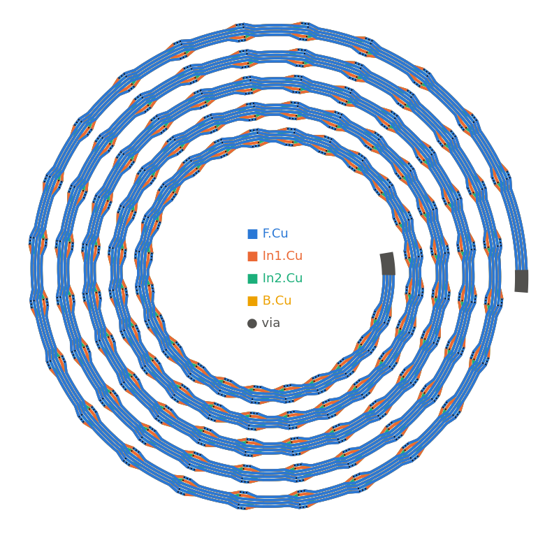
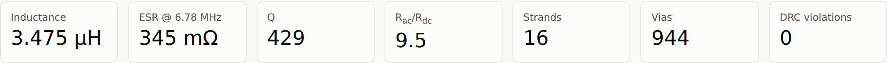
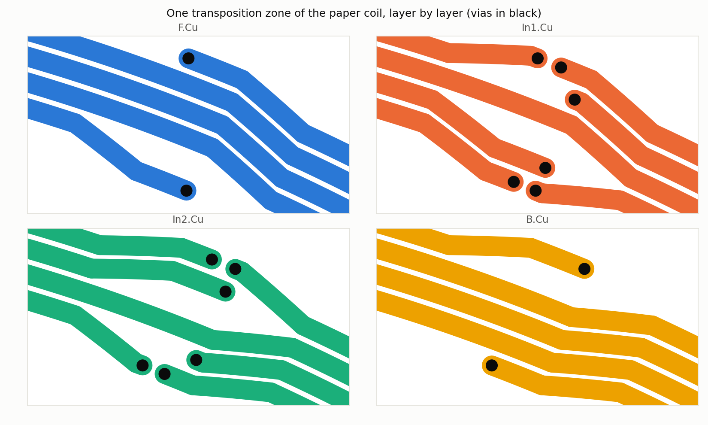
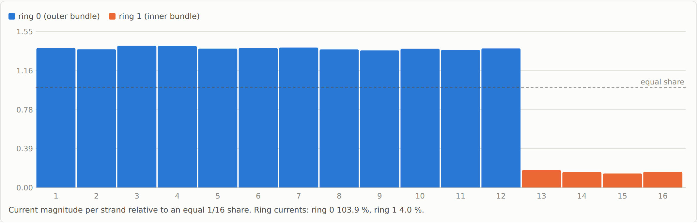
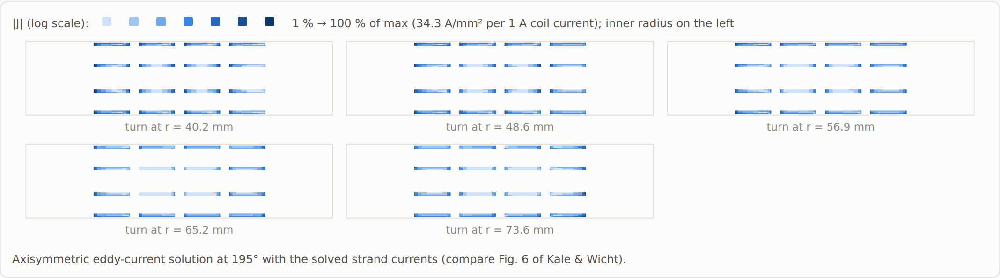

# LitzGen: multi-bundle PCB Litz coils for KiCad

[](https://github.com/jonahsaunders/litzgen/actions/workflows/ci.yml)
[](https://github.com/jonahsaunders/litzgen/releases/latest)
[](https://www.kicad.org/)
[](LICENSE)

LitzGen is a KiCad PCB-editor plugin. It generates transposed multilayer PCB Litz coils, places them on your board and simulates them. It covers the dual-bundle 4-layer coil from Kale & Wicht ([WPTCE 2026](https://doi.org/10.1109/WPTCE66920.2026.11691238)) and generalises it to any number of layers, strands per layer and concentric bundles.

**[Download the KiCad plugin](https://github.com/jonahsaunders/litzgen/releases/latest/download/litzgen-pcm.zip)** · [Install steps](#install-the-kicad-plugin) · [Design notes](docs/DESIGN.md)

## Install the KiCad plugin

### ➜ [**Download `litzgen-pcm.zip`** (latest release)](https://github.com/jonahsaunders/litzgen/releases/latest/download/litzgen-pcm.zip)

1. Download **`litzgen-pcm.zip`** from the link above. Don't unzip it.
2. In KiCad 8 or 9, open **Plugin and Content Manager** and click **Install from File…** at the bottom left. Select the zip.
3. Install **numpy** into KiCad's Python if it isn't there already:
   * **Windows:** Start menu → *KiCad 9.0 Command Prompt*, then `python -m pip install numpy`
   * **macOS:** `/Applications/KiCad/KiCad.app/Contents/Frameworks/Python.framework/Versions/Current/bin/python3 -m pip install numpy`
   * **Linux:** `python3 -m pip install --user numpy` with the Python that KiCad uses (distribution packages usually already include it)
4. Restart the PCB editor. Open LitzGen from **Tools → External Plugins → LitzGen** or from its toolbar button.

scipy is optional. If it's installed, LitzGen uses it for faster neighbour searches.

Every release is listed on the [Releases page](https://github.com/jonahsaunders/litzgen/releases). Each one has `litzgen-pcm.zip`, a copy with the version number in its name, and an example board (`paper_coil.kicad_pcb`).

> **Status:** Generation, DRC and simulation are covered by the automated tests. The pcbnew front-end has so far only been run against a stand-in for KiCad's Python module. Please [open an issue](https://github.com/jonahsaunders/litzgen/issues/new?template=bug_report.md) if anything misbehaves in your KiCad version.

## What it does

<p align="center"></p>



* **Generate:** builds the spiral out of tracks, arcs and blind/buried vias that each connect two adjacent layers, adds terminal bars, and puts everything in one group. That group can be regenerated from the dialog.
* **Check:** tests clearance between strands and between holes itself. KiCad's own DRC can't see shorts inside a single net, which is how a Litz coil is wired.
* **Simulate:** computes inductance, ESR, Q, Rac/Rdc, the current in each strand and bundle, a loss breakdown and a cross-section current-density map, and writes them to an HTML report.
* **Export:** writes FastHenry `.inp` (strand level, quasi-static) and openEMS scripts (bundle level, for self-resonance).

| One transposition zone, layer by layer | Current sharing at 6.78 MHz |
| --- | --- |
|  |  |



For the paper's coil (160 mm, 5 turns, 4 × 4 strands of 0.8 mm), LitzGen predicts **3.475 µH, 345 mΩ, Q = 429** at 6.78 MHz. The paper measured 3.44 µH and 425 mΩ, and its HFSS simulation gave 3.33 µH and 383 mΩ. The model also predicts that the inner 2 × 2 bundle carries only about 4 % of the current, and that with strands this wide, transposition does not lower ESR at 6.78 MHz. [docs/DESIGN.md](docs/DESIGN.md) explains the method, the validation and these findings.

## Using the dialog

The dialog opens with the paper's Table I values. If the board already has a LitzGen coil, it opens with that coil's parameters instead; they are stored inside the coil's group.

| Button | What it does |
| --- | --- |
| Check DRC | Generates the coil in memory and checks strand-to-strand and hole-to-hole clearance |
| Generate | Places the coil, or replaces the one already on the board with the same group name. Adds In1/In2… copper layers if needed |
| Simulate | Runs in the background, then writes `<group>_report.html` next to the board and opens it |
| Export FastHenry / openEMS | Writes solver input files |
| Remove coil | Deletes every item in the coil's group |

By default every strand is on one net (`LITZ1`) and the two terminal bars are THT footprints. **One net per strand** gives each strand its own net and leaves out the terminals. Use it on a throwaway board so that KiCad's own DRC can independently confirm there are no shorts between strands.

## Command line (no KiCad needed)

```bash
pip install "litzgen @ git+https://github.com/jonahsaunders/litzgen"     # or: python -m pip install .
litzgen params > coil.json                                   # paper defaults as JSON
litzgen generate -p coil.json -o coil.kicad_pcb --drc
litzgen simulate -p coil.json --sweep --report coil.html --json result.json
litzgen sweep --vary steps_per_turn=12,18,24 --quality fast
litzgen export fasthenry -o coil.inp
```

Override any parameter with `--set key=value`, including nested ones such as `--set stackup.copper_thickness=0.035`. `examples/` has the paper coil and a hollow-bundle variant.

## Development

```bash
python -m pip install numpy scipy
python -m unittest discover -s tests -v      # 27 tests: geometry, DRC, exports, solver physics, pcbnew writer
python build_pcm.py                          # -> dist/litzgen-pcm.zip
```

### Publishing a release (maintainers)

The download link above always points at the newest release's `litzgen-pcm.zip`. The **Release** workflow builds and uploads that file:

1. Bump `__version__` in `litzgen/__init__.py` and add an entry to `CHANGELOG.md`.
2. Commit, then tag and push:
   ```bash
   git tag v1.0.0
   git push origin main --tags
   ```
3. GitHub Actions runs the tests, builds the zip and creates the release. The workflow fails if the tag and `__version__` don't match.

The download link returns 404 until the first tag has been pushed.

## Limitations

* Tested with KiCad 8/9 (SWIG `pcbnew` API). A front-end for the KiCad 10 IPC API (kipy) is planned.
* Resistance comes from a locally axisymmetric cross-section model. Pads are ignored, and the coil's self-capacitance and self-resonance are not modelled (use the openEMS export for those).
* The inner terminal has a bar but no lead-out, because the coil occupies every layer. Bring it out with a wire or bus bar.

## Citation

The default geometry reproduces: S. Kale and B. Wicht, "A Dual-Bundle PCB Litz Coil Achieving 1 kW, 6.78 MHz WPT with 97.8 % AC-AC Efficiency," *IEEE Wireless Power Technology Conference and Expo (WPTCE)*, 2026, doi:[10.1109/WPTCE66920.2026.11691238](https://doi.org/10.1109/WPTCE66920.2026.11691238). LitzGen is an independent implementation and is not affiliated with the authors.

## License

[MIT](LICENSE) © 2026 Jonah Saunders
